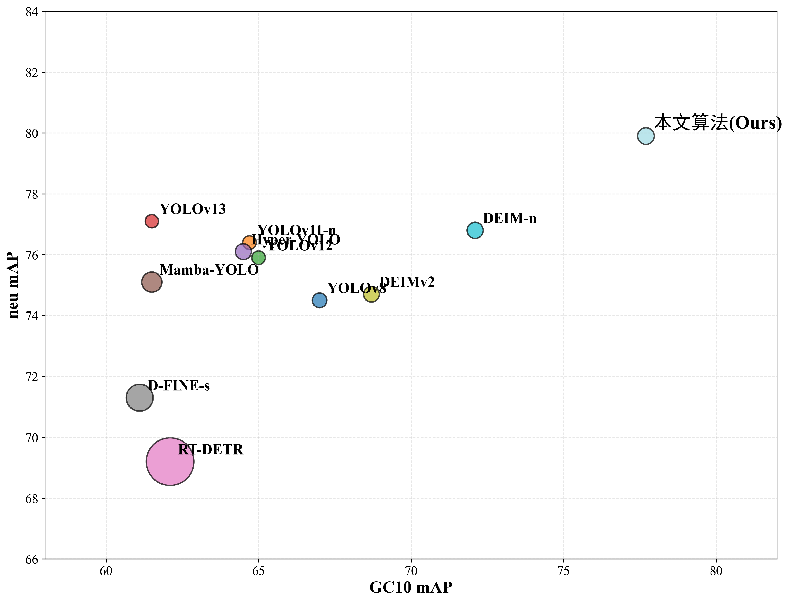

# 多尺度边缘感知网络


## 1、安装

使用 pip 在 3.10>=Python>=3.7 环境中安装 ultralytics 包，包括所有 requirements.txt 文件，其中 PyTorch>=1.7 也包含在内。

```
pip install ultralytics
```

## 2、用法

```
CUDA_VISIBLE_DEVICES=0 torchrun --standalone --nnodes=1 --nproc_per_node=1 train.py -c /project/deim/configs/deim.yml --seed=0
```

## 3、代码与预训练模型

我们将逐步更新代码库，请耐心等待。如有任何疑问，请在 issues 中提交。

## 4、结果


